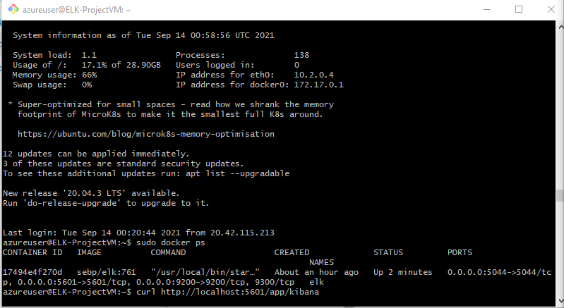

## Automated ELK Stack Deployment

The files in this repository were used to configure the network depicted below.

These files have been tested and used to generate a live ELK deployment on Azure. They can be used to either recreate the entire deployment pictured above. Alternatively, select portions of the play-book file may be used to install only certain pieces of it, such as Filebeat.

 [play-book](playbook-files/elk-install.yml)

This document contains the following details:
- Description of the Topology
- Access Policies
- ELK Configuration
  - Beats in Use
  - Machines Being Monitored
- How to Use the Ansible Build

### Description of the Topology

The main purpose of this network is to expose a load-balanced and monitored instance of DVWA, the D*mn Vulnerable Web Application.

Load balancing ensures that the application will be highly efficient, in addition to restricting traffic to the network.
the load balancer helps to distribute traffic between webservers so that they are not overwelmed  so they are not overwhelmed by the thousands of user requests. Thus helps to prevents denial of service attacks(DoS) and ensuring that data is readily available at everytime. the jumpbox was used to access the different virtual machines via SSH 

Integrating an ELK server allows users to easily monitor the vulnerable VMs for changes to the metrics and system files.
 
The configuration details of each machine may be found below.
_Note: Use the [Markdown Table Generator](http://www.tablesgenerator.com/markdown_tables) to add/remove values from the table_.

| Name     | Function  | IP Address | Operating System |
|----------|---------- |------------|------------------|
| Jump Box | Gateway   | 10.1.0.8   | Linux            |
| web1     | webserver | 10.1.0.5   | Linux            |
| web2     | webserver | 10.1.0.6   | linux            |
| elk vm   | Monitoring| 10.2.0.4   | Linux            |

### Access Policies

The machines on the internal network are not exposed to the public Internet. 

Only the Jumpbox(through port 22) and Elk-ProjectVM(through port 80) can accept connections from the Internet. Access to this machine is only allowed from the following IP addresses:
20.109.7.189 via the Elk-ProjectVM and 40.71.96.190 via the jumpbox.

Machines within the network can only be accessed by my home Public IP.

A summary of the access policies in place can be found in the table below.

| Name          | Publicly Accessible | Allowed IP Addresses |
|----------     |---------------------|----------------------|
| Jump Box      | Yes                 | 40.71.96.190         |
| web 1         | no                  | 10.1.0.5             |
| web 2         | no                  | 10.1.0.6             |
| Elk-projectVM | yes                 | 20.109.7.189
### Elk Configuration

Ansible was used to automate configuration of the ELK machine. No configuration was performed manually, which is advantageous because its limits the possibility of human errors. It adds automation which saves time in building the containers.

The playbook implements the following tasks:

- 	installs docker.io
-	installs python3
- 	installs docker module pip
- 	download and launch a docker elk container
- 	enable service docker on boot

The following screenshot displays the result of running `docker ps` after successfully configuring the ELK instance.

### Target Machines & Beats
This ELK server is configured to monitor the following machines:
- web 1 - 10.1.0.5
- web 2 - 10.1.0.6

We have installed the following Beats on these machines:
- filebeat
- metricbeat

These Beats allow us to collect the following information from each machine:
- filebeat is for the log data and the files that has been accessed which can be used for monitoring system activities
- metricbeats provides information about the system performance and usage.

### Using the Playbook
In order to use the playbook, you will need to have an Ansible control node already configured. Assuming you have such a control node provisioned: 

SSH into the control node and follow the steps below:
- Copy the playbook file to ansible folder.
- Update the hosts file to include webservers and elk IPs.
- Run the playbook, and navigate to http://20.109.7.189:5601/app/kibana to check that the installation worked as expected.

_As a **Bonus**, provide the specific commands the user will need to run to download the playbook, update the files, etc._

ansible-playbook /etc/ansible/elk-install.yml
ansible-playbook /etc/ansible/pentest.yml
ansible-playbook /etc/ansible/roles/filebeat-playbook.yml
ansible-playbook /etc/ansible/roles/metricbeat-playbook.yml